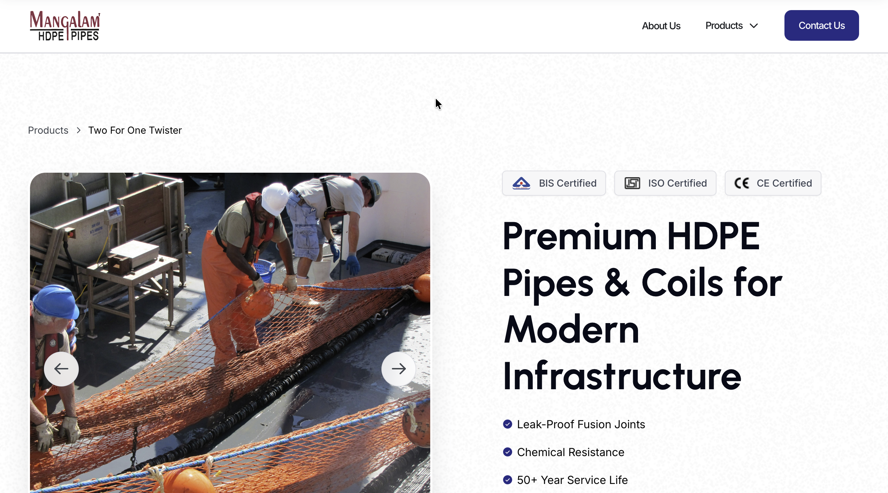

# Frontend Assignment – Responsive Web Page

## Overview

This project is a responsive web page built using vanilla HTML, CSS, and JavaScript, following the provided Figma design specifications.

The implementation focuses on pixel accuracy, smooth interactivity, and clean code structure while ensuring responsiveness across desktop, tablet, and mobile devices

## Features Implemented

### 1. Responsive Design

-   Fully responsive layout across:
1.  Desktop
2.  Tablet
3.  Mobile
-   Implemented using Flexbox and CSS Grid
-   Media queries used for layout adjustments

### 2. Sticky Header
-   Header appears after scrolling beyond the first fold
-   Positioned above the navigation bar as specified
-   Smooth show/hide transition on scroll
-   Disappears when scrolling back up

### 3. Image Carousel
-   Interactive carousel with navigation controls
-   Smooth transitions between images
-   Thumbnail navigation included

### 4. Image Zoom on Hover
-   Hovering over the main image displays a zoomed preview
-   Smooth hover transitions for better UX

## Note on Thumbnail Design (Important)

In the Figma design, the thumbnail section contains empty placeholder boxes.

To improve visual consistency and avoid a broken/empty UI:

I populated all thumbnail boxes with the same image
Added a blue border highlight on hover/active state

This ensures:

The UI does not appear incomplete
The interaction feels intentional and polished
Matches expected real-world behavior when actual images are not provided

## Project Structure

project-folder/
│
├── index.html        # Main HTML structure
├── styles.css        # Styling and responsive design
├── script.js         # Interactivity and functionality
│
└── assets/
    ├── icons/        # SVGs and icon assets
    └── images/       # All image files used in the project

## Technologies Used

1.  HTML5 (Semantic markup)
2.  CSS3 (Flexbox, Grid, Animations)
3.  Vanilla JavaScript (ES6)

## Code Quality

-   Clean and well-structured code
-   Meaningful class names
-   Comments added for key logic
-   Optimized for performance
-   Cross-browser compatible

## Responsiveness
Tested on:
-   Chrome
-   Edge
-   Mobile view (DevTools)

## How to Run
Download or clone the repository
Open index.html in any browser

## Figma Reference :
https://www.figma.com/design/DOv07H7C2tA5UrVLhmfwfW/Gushwork-Assignment?node-id=490-8785&t=Z0PPuWCdxPbNLcSw-1

## Preview:

